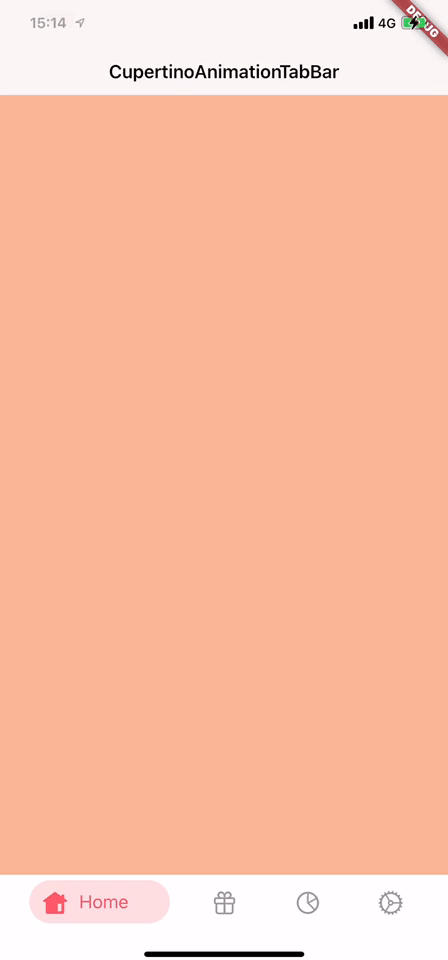

# CupertinoAnimationTabBar

A iOS style animated tab bar.



## Getting Started

Add the dependency in `pubspec.yaml`:

```dart
dependencies:
  ...
  cupertino_animation_tabbar: ^0.0.1
```

## Usage

Create `CupertinoApp` widget

```dart
class MyApp extends StatelessWidget {
  // This widget is the root of your application.
  @override
  Widget build(BuildContext context) {
    return CupertinoApp(
      title: 'CupertinoAnimationTabBar',
      theme: CupertinoThemeData(
        primaryColor: CupertinoColors.activeBlue,
      ),
      home: MyHomePage(title: 'CupertinoAnimationTabBar'),
    );
  }
}
```

Adding tabbar

```dart
class MyHomePage extends StatefulWidget {
  MyHomePage({Key key, this.title}) : super(key: key);

  final String title;

  @override
  _MyHomePageState createState() => _MyHomePageState();
}

class _MyHomePageState extends State<MyHomePage> {
  int _currentIndex = 0;
  List _colors = [
    Color(0xFFF8B595),
    Color(0xFFF67280),
    Color(0xFFC06C84),
    Color(0xFF6C5B7C),
  ];

  @override
  Widget build(BuildContext context) {
    return CupertinoTabScaffold(
      tabBar: CupertinoAnimationTabBar(
        items: [
          BottomNavigationBarItem(
              icon: Icon(
                CupertinoIcons.house_alt,
                color: CupertinoColors.inactiveGray,
              ),
              activeIcon: Icon(
                CupertinoIcons.house_alt_fill,
                color: const Color(0xFFFC5968),
              ),
              label: 'Home'),
          BottomNavigationBarItem(
              icon: Icon(
                CupertinoIcons.gift,
                color: CupertinoColors.inactiveGray,
              ),
              activeIcon: Icon(
                CupertinoIcons.gift_fill,
                color: const Color(0xFFFC5968),
              ),
              label: 'Gfitbag'),
          BottomNavigationBarItem(
              icon: Icon(
                CupertinoIcons.chart_pie,
                color: CupertinoColors.inactiveGray,
              ),
              activeIcon: Icon(
                CupertinoIcons.chart_pie_fill,
                color: const Color(0xFFFC5968),
              ),
              label: 'Chart'),
          BottomNavigationBarItem(
              icon: Icon(
                CupertinoIcons.settings,
                color: CupertinoColors.inactiveGray,
              ),
              activeIcon: Icon(
                CupertinoIcons.settings_solid,
                color: const Color(0xFFFC5968),
              ),
              label: 'Setting'),
        ],
        activeColor: const Color(0xFFFC5968),
        currentIndex: 0,
        onTap: (index) => _currentIndex = index,
      ),
      tabBuilder: (context, index) {
        return CupertinoTabView(builder: (context) {
          return CupertinoPageScaffold(
            navigationBar: CupertinoNavigationBar(
              middle: Text('CupertinoAnimationTabBar'),
            ),
            child: Center(
              child: Text(''),
            ),
            backgroundColor: _colors[index],
          );
        });
      },
    );
  }
}
```

## Customization tabbar

### BottomNavigationBarItem

* `icon` - the icon of this item
* `activeIcon` - the active icon of this item
* `label` - the text that will appear next to the icon when this item is active

### CupertinoAnimationTabBar

* `items` - tabbar items to show
* `iconSize` - the item icon's size, default to 24.0
* `currentIndex` - the current item index. Use this to change the selected item, default to 0
* `backgroundColor` - the tabbar's backgroud color, default to white
* `activeColor` - the item active backgroud color, default to 0xFFFC5968
* `onTap` - the item selected action